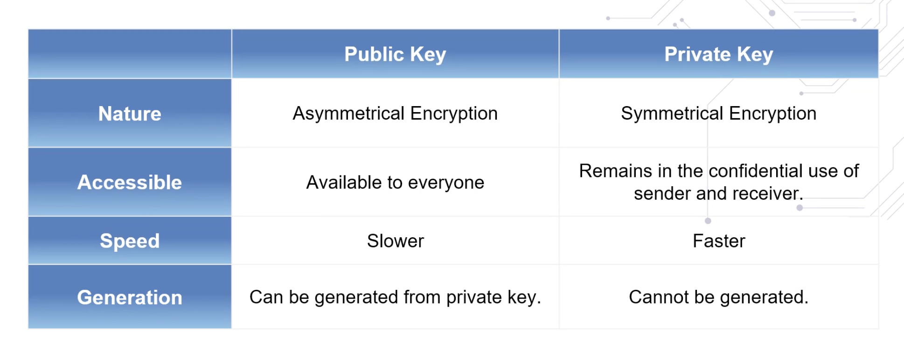

# public key cryptography

also known as symmetric key encryption, the earliest form of written encryption if the caesar encryption.

- shift every letter in the text by x positions right and then use that key to decrypt it by shifting x left.

- symmetric key is when the encryption and decryption key are essentially the same.
    - security issues are that its easy to break and how do you pass to authorized users.

# asymmetric key (private-public key pair)

private keys are kept safe and locked.
public keys are published for consumption.

private keys generally do the encryption while the public keys generally do the decryption.

`rsa (rivest shamir adelman) algorithm`

the rsa algorithm is the most popular form of private-public key encryption.

`ecc (elliptic curve cryptography)`

ecc is used generating key-pairs in ethereum and bitcoin.

ecc is stronger than rca encryption; for example:

- 256 bits ecc key pair approx. equal to 3072 bits rsa key pair

---

Title of resource: What Is Public-Key Cryptography?

https://www.globalsign.com/en/ssl-information-center/what-is-public-key-cryptography

Description: A look at the encryption algorithm and its security benefits

---

Title of resource: Asymmetric Cryptography (Public-Key Cryptography)

https://searchsecurity.techtarget.com/definition/asymmetric-cryptography

Description: Article explains what Asymmetric cryptography is and how it works

---

Title of resource: Public Key Cryptography - Computerphile

https://www.youtube.com/watch?v=GSIDS_lvRv4

Description: Youtube video that explains how public key cryptography works.

---

# hashing

A hash function or hashing transforms and maps an arbitrary length of input data value to a unique fixed length value.
- Input data can be a document, tree data, or a block data.

The following are two basic requirements of a hash function.

- the algorithm chosen for the hash function should be a one-way function

- it should be collision free, or exhibit extremely low probability of collision.
    - There should be extremely low probability that two different datasets map onto the same hash value.

`merkel-tree hash`

When the number of items differ from block to block.

for example: number of transactions, number of states, number of receipts, we use the tree structure for computing the hash

What type of hash is used when there is a fixed number of items to be hashed, such as the items in a block header, and we are verifying the composite block integrity?

- simple hash

What type of hash function is used, when there is variable number of items to be hashed, such as the many state changes in a block?

- tree structured hash

---

Title of resource: What Is Hashing? Under The Hood of Blockchain

https://blockgeeks.com/guides/what-is-hashing/

Description: An article that not only explains the basics of hashing but introduces a more specific type of hashing and how it affects the mining process.

---

Title of resource: SHA: Secure Hashing Algorithm - Computerphile

https://www.youtube.com/watch?v=DMtFhACPnTY

Description: Dr. Mike Pound explains how files are used to generate seemingly random hash strings.

---

Title of resource: Hash Functions

https://www.cs.hmc.edu/~geoff/classes/hmc.cs070.200101/homework10/hashfuncs.html

Description: Explanations and examples of simple hash functions and the hashing sequences of characters.

---

# transaction integrity

To manage the integrity of a transaction we need:

- number one, secure a unique account address. We need a standard approach to uniquely identify the participants in the decentralized network.

- Number two, authorization of the transaction by the sender through digital signing.

- number three, verification that the content of that transaction is not modified.

essentially, digital signatures supports both user authentication and integrity of messages.

addresses of accounts are generated used public-private key pairs:

- at 256-bit random number is generated, and designated as the private key. Kept secure and locked using a passphrase.

- an ECC algorithm is applied to the private key, to get a unique public key. This is the private public key pair.

- Then a hashing function is applied to the public key to obtain account address. The address is shorter in size, only 20 bytes or 160 bits.

Now that we have the account address, let's look at the transaction initiated by this address.

- A transaction for transferring assets will have to be authorized,it has to be non-repudiable, unmodifiable.

`Data is hashed and encrypted. This is the digital signature.`

The receiver gets the original data, and the secure hash digitally signed. Receiver can recompute the hash of the original data received, and compare it with the received hash to verify the integrity of the document.

---

Title of resource: How Safe Are Blockchains? It Depends.

https://hbr.org/2017/03/how-safe-are-blockchains-it-depends

Description: Article explains the inherent security risks in blockchain technology, by going into the differences between public and private blockchains.

---

Title of resource: Blockchains: Embedding Integrity

https://infospectives.co.uk/2016/01/05/blockchains-embedding-integrity/

Description: Article explains why big corporations and financial institutions are spending lots of time and money looking into Blockchain.

---

# securing blockchain

Integrity of the ethereum block is managed by assuring that:

- the block header contents are not tampered with,
- the transactions are not tempered with,
- state transitions are efficiently computed, hashed, and verified.

It is computed by applying a variant of SHA-3 algorithm called Keccak and all the items of the block header.

In Ethereum, the block hash is the hash of all the elements in the block header.

#### Smart contract execution in Ethereum results in state transitions.

- Every state change requires state root hash re-computation.

Block hash in Ethereum is computed by first computing the state root hash, transaction root hash and then receipt root hash, shown at the bottom of the block header.

These roots and all the other items in the header are hash together with the variable nodes to solve the proof of work puzzle.

In Ethereum, hashing functions are used for generating account addresses, digital signatures, transaction hash, state hash, receipt hash, and block header hash

In ethereum, Addresses of account are generated using the public key-private key pair.
- First, a 256-bit random number is generated and designated as a private key, kept secure and locked using a passphrase.
- Then an ECC algorithm is applied to the private key to get a unique public key.

SHA-256 is the type of hashing algorithm Bitcoin blockchain uses to determine the hash of a block.

- SHA-256 is a one-way hash function, that is a function which is infeasible to invert.

---

Title of resource: What is a Block Header in Bitcoin?

https://www.cryptocompare.com/coins/guides/what-is-a-block-header-in-bitcoin/

Description: Article explains how to calculate and identify a block header.

---