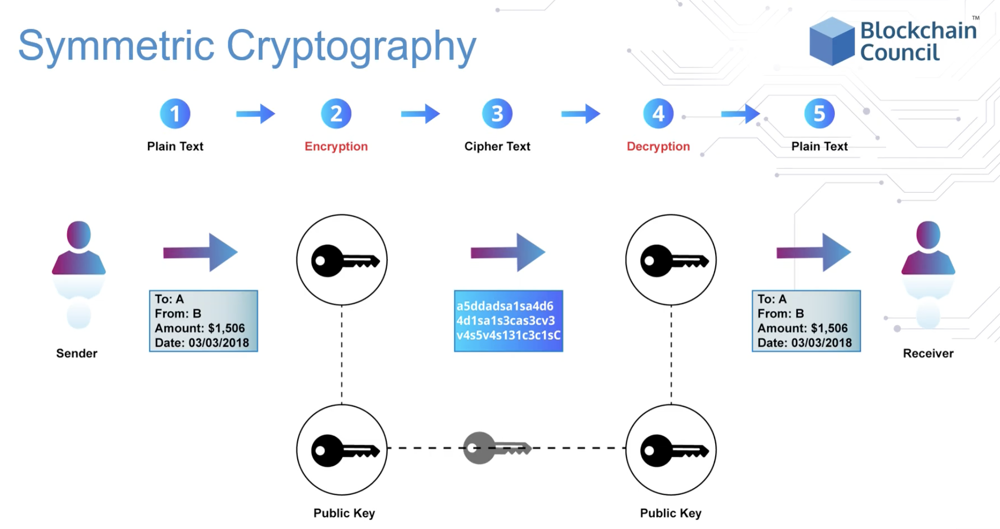
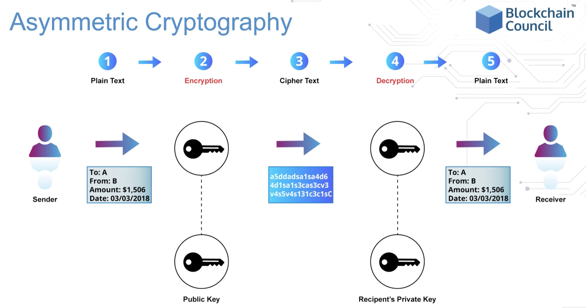
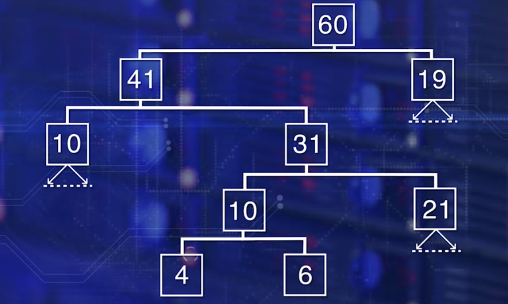

# symmetric encryption

also known as symmetric key encryption, the earliest form of written encryption if the caesar encryption.

- shift every letter in the text by x positions right and then use that key to decrypt it by shifting x left.

- symmetric key is when the encryption and decryption key are essentially the same.
    - security issues are that its easy to break and how do you pass to authorized users.

symmetric key encryption is useful:
- when algorithms are inexpensive to process
- when the key tends to be smaller for the level of protection
- when the user don't need to experience any delay in the process of encryption and decryption.

# asymmetric encryption (private-public key pair)

private keys are kept safe and locked.
public keys are published for consumption.
- typical size is 1024 bits 2048 bits

private keys generate the public keys via an algorithm like sha256()
- both keys are stored in a digital wallet
- when a transaction is initiated, the transactions are digitally signed using the public key before they are broadcasted to the other nodes on the blockchain.
    - the digital signature proves the ownership of the private key

public keys generally do the encryption while the private keys generally do the decryption.
- public keys can be shared or published to other individuals, private key must remain secret from others, as the same private key can only decrypt data encrypted by the same private key.

when the digital signature is proven to ultimately come from the private key, the transaction is sent to the recipients public address.
- if a transaction is altered, the digital signature will change as well

since its impossible to generate a private key from a public key or pubic address, its possible to lose balance if you lose the private key
- cold storage means a wallet that holds private keys are stored offline.
- hot storage means a when a wallet that holds private keys are connected to systems using the internet.

`rsa (rivest shamir adelman) algorithm`

the rsa algorithm is the most popular form of private-public key encryption.

`ecc (elliptic curve cryptography)`

ecc is used generating key-pairs in ethereum and bitcoin.

ecc is stronger than rca encryption; for example:

- 256 bits ecc key pair approx. equal to 3072 bits rsa key pair

---

Title of resource: What Is Public-Key Cryptography?

https://www.globalsign.com/en/ssl-information-center/what-is-public-key-cryptography

Description: A look at the encryption algorithm and its security benefits

---

Title of resource: Asymmetric Cryptography (Public-Key Cryptography)

https://searchsecurity.techtarget.com/definition/asymmetric-cryptography

Description: Article explains what Asymmetric cryptography is and how it works

---

Title of resource: Public Key Cryptography - Computerphile

https://www.youtube.com/watch?v=GSIDS_lvRv4

Description: Youtube video that explains how public key cryptography works.

---

# hashing

A hash function or hashing transforms and maps an arbitrary length of input data value to a unique fixed length value.
- Input data can be a document, tree data, or a block data.

The following are two basic requirements of a hash function.

- the algorithm chosen for the hash function should be a one-way function

- it should be collision free, or exhibit extremely low probability of collision.
    - There should be extremely low probability that two different datasets map onto the same hash value.

---

What type of hash is used when there is a fixed number of items to be hashed, such as the items in a block header, and we are verifying the composite block integrity?

- simple hash

What type of hash function is used, when there is variable number of items to be hashed, such as the many state changes in a block?

- tree structured hash

# merkle tree

a merkle tree is a data structure trees where each non-leaf node is the hash of its corresponding child nodes.

it basically summarizes the transactions by hashing together hashed transactions which reduces the data size for memory.

using a merkle tree seperates the validation of the data from the data itself (integrity).
- a merkle tree can be stored locally or on a distributed system.
- by just using the hashes, this method saves memory usage since you don't have download an entire block.

since merkle tree are binary, meaning it needs an even number of leaf nodes, the last hash will be duplicated to create an even number of leaf nodes.

- 1 branch of a merkel tree can be downloaded at a time and the integrity can be immediately verified even if the entire merkel tree is not yet available.

- if the number of nodes is odd, than the last hash is duplicated so that the merkle tree has an even number of nodes

##### the main advantage of a merkel tree is that files can be broken up into very small blocks for quick data verification.

merkle tree's hash nodes until it reaches a root node -- the merkle root.

- the merkle root summarizes all the data (the associated transaction) and stored in the header to maintain integrity.
    - if you change any of the transactions it will change the hash and ultimately the merkel root.

`merkel-tree hash`

When the number of items differ from block to block.

for example: number of transactions, number of states, number of receipts, we use the tree structure for computing the hash

example, there are 424 transactions. a merkle tree would organize the transactions into 212 pairs, next the id pairs would be hashed. the hashed 212 pairs would be organized into 106 pairs again and hashed and this process repeats until there is only node left: the merkle root.

the merkle root is a summary of the transactions and stored in the block header.

# why merkle trees are vital to blockchain

for confirming a past transaction, a node would need to reach out to the network in order to get copies of the ledger from its peers.

- the node would need to compare each entry line by line.
    - every verification would require large packets of information to be sent over the network.
- any discrepancy between the ledgers, compromise the security of the network.
- lot of processing power are consumed to compare the ledgers, to ensure that there had been no changes.

---

Title of resource: What Is Hashing? Under The Hood of Blockchain

https://blockgeeks.com/guides/what-is-hashing/

Description: An article that not only explains the basics of hashing but introduces a more specific type of hashing and how it affects the mining process.

---

Title of resource: SHA: Secure Hashing Algorithm - Computerphile

https://www.youtube.com/watch?v=DMtFhACPnTY

Description: Dr. Mike Pound explains how files are used to generate seemingly random hash strings.

---

Title of resource: Hash Functions

https://www.cs.hmc.edu/~geoff/classes/hmc.cs070.200101/homework10/hashfuncs.html

Description: Explanations and examples of simple hash functions and the hashing sequences of characters.

---

# transaction integrity

To manage the integrity of a transaction we need:

- number one, secure a unique account address. We need a standard approach to uniquely identify the participants in the decentralized network.

- Number two, authorization of the transaction by the sender through digital signing.

- number three, verification that the content of that transaction is not modified.

essentially, digital signatures supports both user authentication and integrity of messages.

addresses of accounts are generated used public-private key pairs:

- at 256-bit random number is generated, and designated as the private key. Kept secure and locked using a passphrase.

- an ECC algorithm is applied to the private key, to get a unique public key. This is the private public key pair.

- Then a hashing function is applied to the public key to obtain account address. The address is shorter in size, only 20 bytes or 160 bits.

Now that we have the account address, let's look at the transaction initiated by this address.

- A transaction for transferring assets will have to be authorized,it has to be non-repudiable, unmodifiable.

`Data is hashed and encrypted. This is the digital signature.`

The receiver gets the original data, and the secure hash digitally signed. Receiver can recompute the hash of the original data received, and compare it with the received hash to verify the integrity of the document.

---

Title of resource: How Safe Are Blockchains? It Depends.

https://hbr.org/2017/03/how-safe-are-blockchains-it-depends

Description: Article explains the inherent security risks in blockchain technology, by going into the differences between public and private blockchains.

---

Title of resource: Blockchains: Embedding Integrity

https://infospectives.co.uk/2016/01/05/blockchains-embedding-integrity/

Description: Article explains why big corporations and financial institutions are spending lots of time and money looking into Blockchain.

---

# securing blockchain

Integrity of the ethereum block is managed by assuring that:

- the block header contents are not tampered with,
- the transactions are not tempered with,
- state transitions are efficiently computed, hashed, and verified.

It is computed by applying a variant of SHA-3 algorithm called Keccak and all the items of the block header.

In Ethereum, the block hash is the hash of all the elements in the block header.

#### Smart contract execution in Ethereum results in state transitions.

- Every state change requires state root hash re-computation.

Block hash in Ethereum is computed by first computing the state root hash, transaction root hash and then receipt root hash, shown at the bottom of the block header.

These roots and all the other items in the header are hash together with the variable nodes to solve the proof of work puzzle.

In Ethereum, hashing functions are used for generating account addresses, digital signatures, transaction hash, state hash, receipt hash, and block header hash

In ethereum, Addresses of account are generated using the public key-private key pair.
- First, a 256-bit random number is generated and designated as a private key, kept secure and locked using a passphrase.
- Then an ECC algorithm is applied to the private key to get a unique public key.

SHA-256 is the type of hashing algorithm Bitcoin blockchain uses to determine the hash of a block.

- SHA-256 is a one-way hash function, that is a function which is infeasible to invert.

---

Title of resource: What is a Block Header in Bitcoin?

https://www.cryptocompare.com/coins/guides/what-is-a-block-header-in-bitcoin/

Description: Article explains how to calculate and identify a block header.

---

# cryptography

cryptography is a technique to secure data by writing or generating codes that make the information unreadable for the unauthorized individual.

cryptographic algorithms usually involve:
- cryptographic key generation
- digital signing
- verification to protect privacy

blockchain is guarded by primarily these cryptographic algorithms:
- sha256
    - the information is broken down into 512 bits, produces a cryptographic mix, and then attaches a 256 bit hash code.
- elliptic curve cryptography (ecc)
    - a curve where the public key is the mirror reflection of the private key on the curve.
        - blockchain commmonly uses secp256k1 for digital signatures.
- ripemd160
