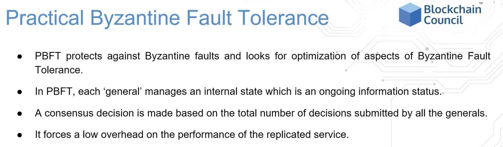

smart contracts help you exchange money, property, shares, or anything of value in a transparent without a middleman.
- the entire process is automated & can act as a compliment, substitute for legal contracts, where the terms of the smart contract are recorded in a computer language as a set of instructions.

# what is consensus?

consensus mechanisms make sure all nodes are synchronized with each other and agree on which transactions are legitimate and are added to the blockchain.
- since blockchain does not rely on a 3rd party validation, the distributed nodes need to agree on the validity of the transactions.
- consensus assures that the protocol rules are being followed and guarantee that all transactions occur in a trustless way -- since the parties don't know each other.

# how does the consensus resolve the byzantine general problem?

the Byzantine Generals Problem is that there are multiple generals, with their own armies, very far apart from one another and need to be able to communicate with each other to attack or retreat together against a city with a very large army.
- each general has to make their own decision that cannot be changed, but the generals have to be in agreement over a synchronized action.
- the generals communicate via couriers, who's messages can get delayed, destroyed, altered, or lost.

the solution is to have a majority of honest/reliable generals (nodes in a distributed p2p network)
- this can lead to a 51% attack though

miners compete to guess the nonce inside a block.
- miners running algorithms to guess the nonce on gpu machines are rewarded and transaction fee.

a nonce is just a random number in a block (influenced by the nonce) that makes the hash of the block start with a particular number of leading zeros.
- once the nonce is identified, the miner announces it to the whole network for validation on other nodes.

---

---

