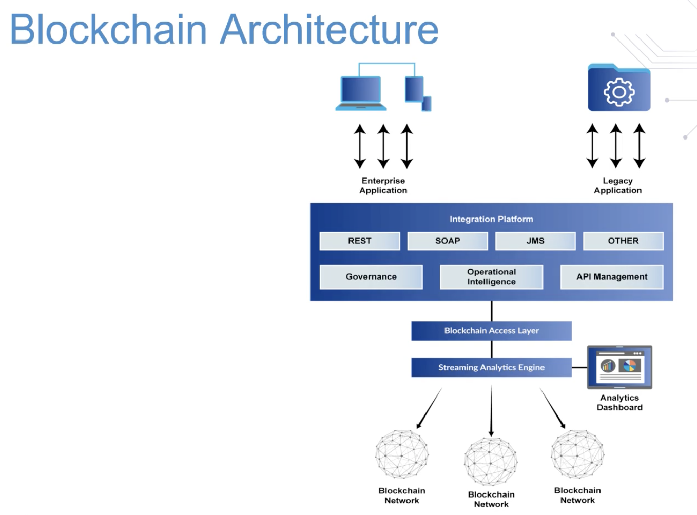

# transactions

the process of a transaction is:

1. the initiation of a transaction proposal where the transaction is created and digitally signed by the owner.

2. once the transaction has been signed, it gets broadcasted by the wallet to the other nodes to be picked up by the miners.
- miners select transactions from a pool of unprocessed transactions and form a block.
- every miner creates their own block which may share the same transactions.

3. once broadcasted, the authorized nodes verify the transactions and either add it to the block if valid or reject it otherwise.

4. once the transaction is validated, the block is added to the blockchain permanently and the miner is rewarded with tokens.

---

consensus algorithm is the process of maintaining the ledger transactions synchronized throughout the network to confirm that ledgers are only updated when transactions are approved by the appropriate participants.

- when ledgers do update, they update with the same transactions in the same order.

A scaling issue with Bitcoin is that there can only be 21 million bitcoins in the market and a transaction cannot exceed 1 mg.
- the mg limit means that only 3-4 transactions will be able to process per second which is not an economy of scale.

---

# crypto-currency mining

miners earn bitcoin from verifying transactions, they must verify 1 megabyte worth of transactions.

in order for miners to add a block of transactions to the blockchain, they have to solve the proof of work algorithm with the timestamp that validates the block.

- any transaction happening on the blockchain has a puzzle associated with it.

    - the puzzle is to solve the nonce -- a random number -- which the miners guess.

- when a miner guesses or approximates the nonce, they confirm the transaction for the network and are rewarded with tokens.

    - guessing the nonce is computationally intensive.

# blockchain exchanges

blockchain exchanges find the cheapest rates of exchange between any two cryptocurrencies thus making it more affordable to trade tokens or cryptocurrencies.

exchanges used for trading could utilize hardware wallets or they can create their own wallets on an exchange website like coinbase.

# private vs public blockchains

public blockchains are where anyone can read and write without explicit authorization and permission.
- validation of transactions are completed through a consensus algorithm via proof of work or proof of stake.

private blockchains are where authorization nodes can read and write the transaction data into blockchain.
- only authorized nodes can be the arbitrator for any dispute.
- adding blocks in a private blockchain is comparatively less computational because the authorized nodes don't need to solve a complex puzzle.

federated/consortium blockchain is a group-owned system where more than 1 central node is in charge that provides access to pre-selected nodes to read, write, and audit the blockchain.