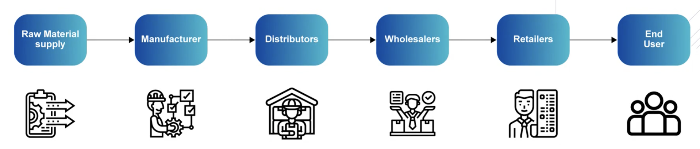
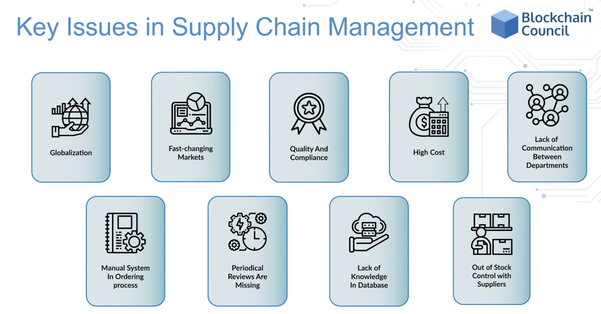
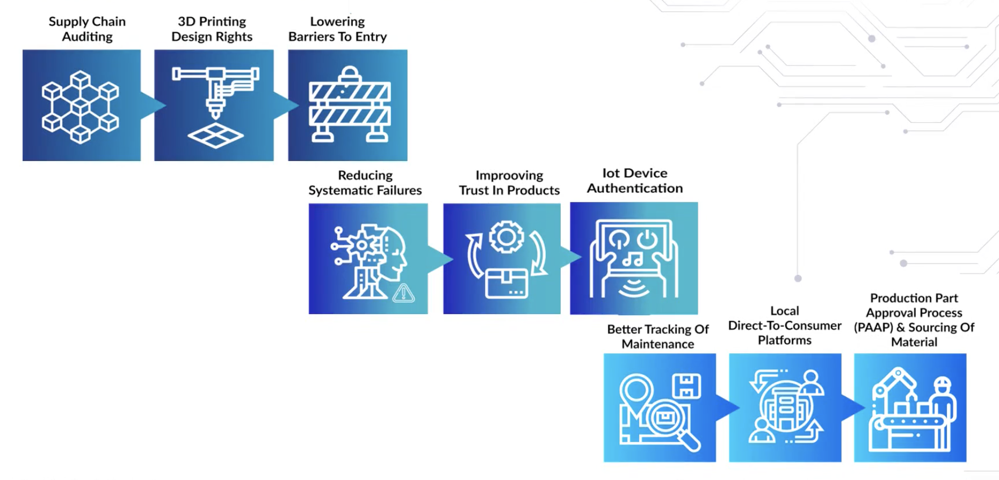

# supply chain

a supply chain is a network of individual entities, businesses, resources as well as technologies, combine together in the manufacturing of a product or service. 

with a blockchain, the product history can be outlined in publicly visible ledger.

the elimination of middleman reduces fraud and reduces cost from product duplication.

# manufacturing

# automobiles

