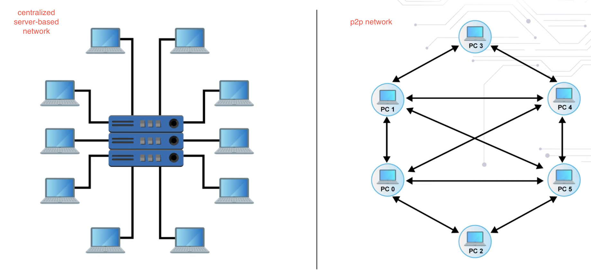

# peer-to-peer network

a p2p network is a group of devices that collectively store and share files.
- each node serves as an individual peer with equal power and performs the same tasks.

each peer in a p2p network holds a copy of the files and acts as both a client and server to other nodes.
- each node can download files from other nodes or upload files to them.

in a centralized network, a client would ONLY download files from a single server -- which is the opposite of a p2p network.

p2p networks are not secure and are best at serving a small group of users on a private network.
- p2p networks dont have a single point of failure though and are generally pretty fast.

# p2p architecture

##### unstructured p2p

p2p unstructured architecture means that the nodes aren't deliberately organized and communicate randomly with one another.
- the randomness though requires high cpu usage for querying.

##### structured p2p

p2p structure is an organized design that allows for precision querying that use hash functions for database lookups.
- stuctured p2p require higher maintenance due to higher centralization.

##### hybrid p2p

a combination of stucture and unstructured p2p design

# blockchain - distributed p2p network

in blockchain, each participant within the network maintains, approves, and updates new entries.
- each node carries a copy of the blockchain

since the blockchain is contained on each node, it protects it from a distributed denial of service attack (DDOS)

blockchain is an example of a Byzantine fault tolerance system which is able to continue operating even if some of the nodes fail or act maliciously.

despite adding high security, adding a transaction on each node in blockchain requires high computational power.

---

# decentralized network

Trust in a decentralized blockchain is about:
- securing the chain using specific protocols
- validating the transactions and blocks for tamper proofing.
- executing and confirming the transactions.

Proof of work is the consensus protocol used by Bitcoin blockchain and Ethereum Byzantium Metropolis blockchain.

double spending is when multiple miners solve the problem with proof of work puzzle at approximately the same time.

Trust in robustness is the ability to handle natural exceptional situations such as a chain split and double spending.

In Ethereum, a combination of account number and a global nonce is used to address the doublet spending issue.

- Every time a transaction is initiated by an account, a global nonce is included in the transaction.

- After that, the nonce is incremented.

- Time stamp on the nonce in the transaction should be unique and verified to prevent any double use of digital asset.

##### when more than one miner solves the consensus puzzle very close in time to each other in Ethereum small incentives are given to the runner up blocks and the new block is added to the main chain.

- in ethereum, this resolves the Double spending issues that is reusing digital assets intentionally or inadvertently.

- in ethereum, a combination of account number and global nonce is used to address issues regarding double spending.

---

Title of Resource: Blockchain Based Trust & Authentication For Decentralized Sensor Networks

https://arxiv.org/pdf/1706.01730.pdf

Description: The article contained on this website summarizes and explores decentralized authentication and node trust informations.

Title of Resource: How the Blockchain will Radically Transform the Economy

https://www.ted.com/talks/bettina_warburg_how_the_blockchain_will_radically_transform_the_economy?utm_campaign=tedspread--b&utm_medium=referral&utm_source=tedcomshare

Description: In this valuable TEDtalk of the complex (and confusing) technology, Bettina Warburg describes how the blockchain will eliminate the need for centralized institutions like banks or governments to facilitate trade, evolving age-old models of commerce and finance into something far more interesting: a distributed, transparent, autonomous system for exchanging value.

---

# proof of work

from the miners point of view in bitcoin and ethereum:

---

Title of Resource: A (Short) Guide to Blockchain Consensus Protocols

https://www.coindesk.com/short-guide-blockchain-consensus-protocols

Description: The article on this website summarizes the different types of proof.

---

Title of Resource: Review of blockchain consensus mechanisms

Resource Type: Website

Description: The article on this website summarizes the different types of proof.

---

Title of Resource: Blockchain Expert Explains One Concept in 5 Levels of Difficulty | WIRED

https://www.youtube.com/watch?v=hYip_Vuv8J0

Description: This video provides a great explanation of blockchain at varying levels of comprehension. Blockchain, the key technology behind Bitcoin, is a new network that helps decentralize trade, and allows for more peer-to-peer transactions. WIRED challenged political scientist and blockchain researcher Bettina Warburg to explain blockchain technology to 5 different people; a child, a teen, a college student, a grad student, and an expert.

---

Title of Resource: How The Blockchain Is Redefining Trust

https://www.wired.com/story/how-the-blockchain-is-redefining-trust/

Description: This helpful article highlights how the blockchain can remove intermediaries from numerous transactions between people, corporations, and a host of other financial interactions.

---

# hard and soft forks

This is soft fork.

Occasionally, a minor process adjustment has to be carried out typically by bootstrapping a new software to the already running processes. You can think of this as a software patch or a bug fix to address an issue.

- For example, the script concept in Bitcoin was introduced using this method.

Hard fork implies a major change in the protocol.

- For example, the recent change from Ethereum Homestead to Metropolis Byzantium version was a planned hard fork and important note after a hard fork the emerging two chains are incompatible.

Forks are mechanisms that add to the robustness of the blockchain framework.

- Well-managed forks help build credibility in the blockchain by providing approaches to manage unexpected faults and planned improvements.

---

Title of Resource: Have Blockchain Forks Shown Hayek to be Right or Wrong?

https://www.trustnodes.com/2017/12/02/blockchain-forks-shown-hayek-right-wrong

Description: This valuable article explores the concept of free market money as proposed by Friedrich Hayek in the 1970’s and its relationship to Blockchain and Bitcoin.

---

Title of Resource: Split on Forks? Blockchain Leaders Learn Tough Lessons from Bitcoin Scaling

https://www.coindesk.com/split-forks-blockchain-leaders-learn-tough-lessons-bitcoin-scaling

Description: This website focuses on how developers need to find ways to conduct upgrades to bitcoin in a smoother manner.

---

Title of Resource: Bitcoin, Blockchain Forks & Lightning

https://www.youtube.com/watch?v=8uF7RVF2osk

Description: In this helpful video, an employee of UCL Security Group summarizes theories to scale bitcoin.
