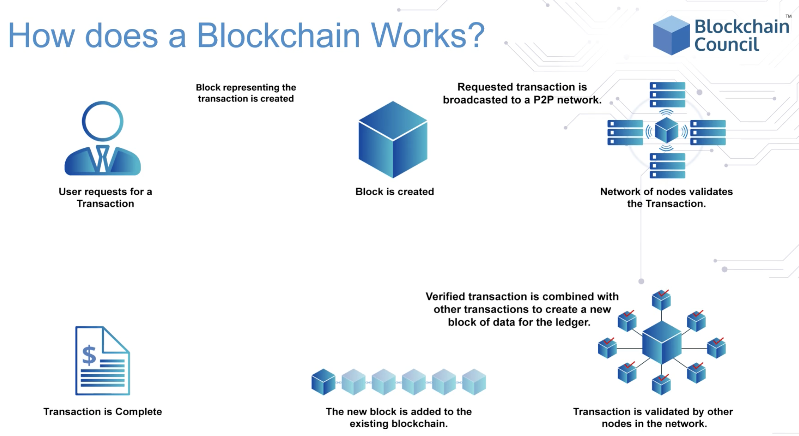
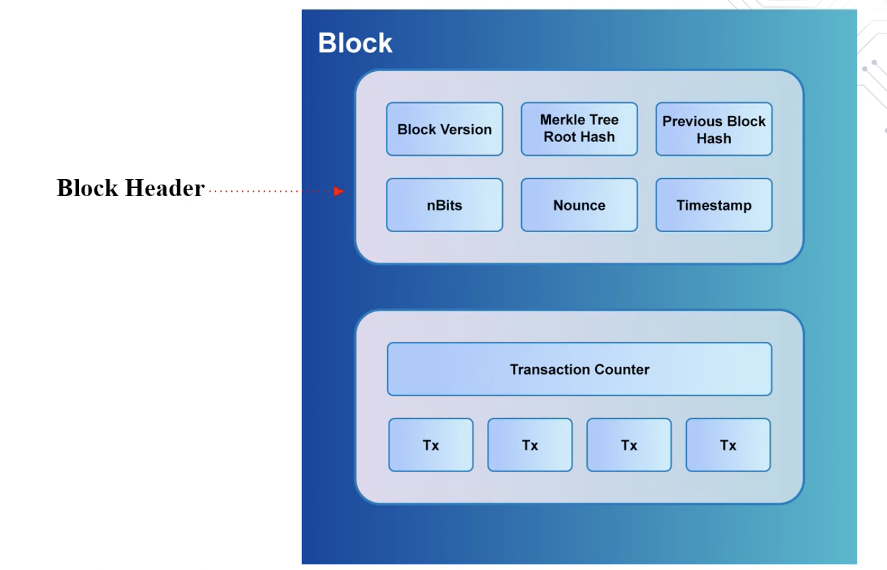
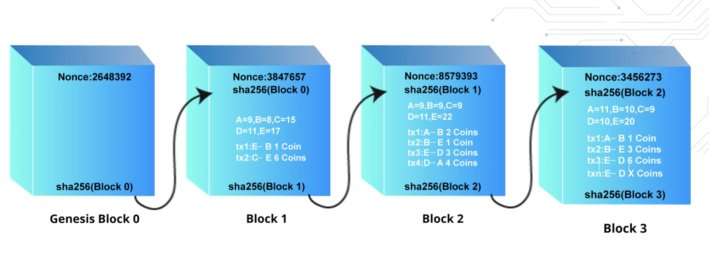
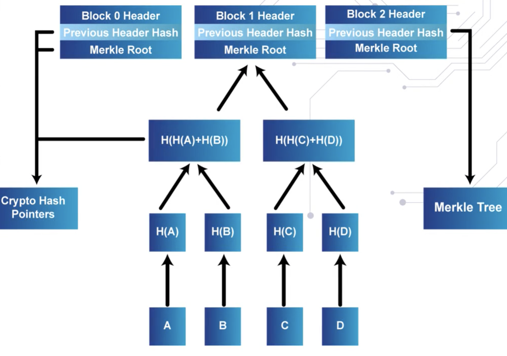

# blockchain process

# elements of the blockchain

blockchain is a time-stamped chain of immutable records, managed by a cluster of computers and not owned by a single entity.

- the ledger, a growing list of records w/ unique hashes are known as blocks, are linked by cryptography.
- blockchain is essentially a group of connected computers to maintain a single updated ledger.

a useful analogy is to visualize the blockchain as a book.
- book = blockchain
- page = block connected to the previous page through a page number
    - due to the page number sequence, tampering is easy to detect
- an entry on a page = blockchain transaction

##### block header

a block header is made up of:

- block version is mostly used to tell miners which version it supports.

- the "previous block hash" illustrates the chain building the series of blocks; without it, there would be chronology between blocks.

- the "merkle tree root hash" encodes the block data into an efficient format that allows for quick verification and data transfer between nodes on peer-2-peer blockchain networks.
    - the data itself is hashed for security and optimization.

- nBits is the encoded form of the target threshold for a valid block

- nonce is the string num variable incremented by the "proof-of-work"
    - a miner random guesses, using cpu power, a hash that is smaller than the target.
    - a miner has to guess the nonce (million to billion)to solve and provide proof of work to generate a random string for the new block

    - the nonce value is calculated based on the difficulty target per the blockchain.

- unix timestamps make it difficult for blocks to be manipulated.
    - a timestamp is only valid if it is greater the median of previous 11 blocks.

##### genesis block

the genesis block contains the starting balance and is the prototype for all blocks.

in the illustration, sha256(Block 0) is the digital signature of the genesis block and represents previous_block_signature in block 1.

sha256() is an algorithm that compresses data into a unique string of a fixed length.
- this one way compression ouputs the digital signature of the block.

# blockchain miners

a miner generates proof of work that the particular block has been validated and added to the blockchain.

for a minor's labor, the miner is rewarded with tokens based on difficulty for solving the nonce.

corrupting the blockchain is difficult because the competing miners validate each other's work

- if a hacker wanted to modify a specific block, the hacker would also have to modify all the proceeding and preceeding blocks as well -- which would be costly and time consuming.

- miners always use the "longest chain rule".

# proof of stake

proof of stake where miners develop a reputation based on the number of tokens they own or their status in the market.

# hashing

hashing is the process of taking an item of a any length and coverting it into an output item of a fixed length.

a popular example of hashing is Bitcoin's sha256() that produces a length of 256 bits.

##### a valid nonce is determined by computing several hashes

# merkle tree 

a merkle tree is a data structure trees where each non-leaf node is the hash of its corresponding child nodes.

it basically summarizes the transactions by hashing together hashed transactions which reduces the data size for memory.

since merkle tree are binary, meaning it needs an even number of leaf nodes, the last hash will be duplicated to create an even number of leaf nodes.

- 1 branch of a merkel tree can be downloaded at a time and the integrity can be immediately verified even if the entire merkel tree is not yet available.

##### the main advantage of a merkel tree is that files can be broken up into very small blocks for quick data verification.

merkle tree's hash nodes until it reaches a root node -- the merkle root.

- the merkle root summarizes all the data (the associated transaction) and stored in the header to maintain integrity.
    - if you change any of the transactions it will change the hash and ultimately the merkel root.

# wallets

a wallet is a program that allows you to exchange cryptocurrency.

