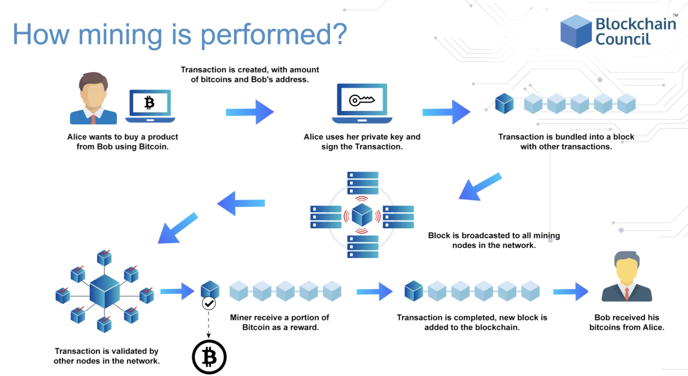
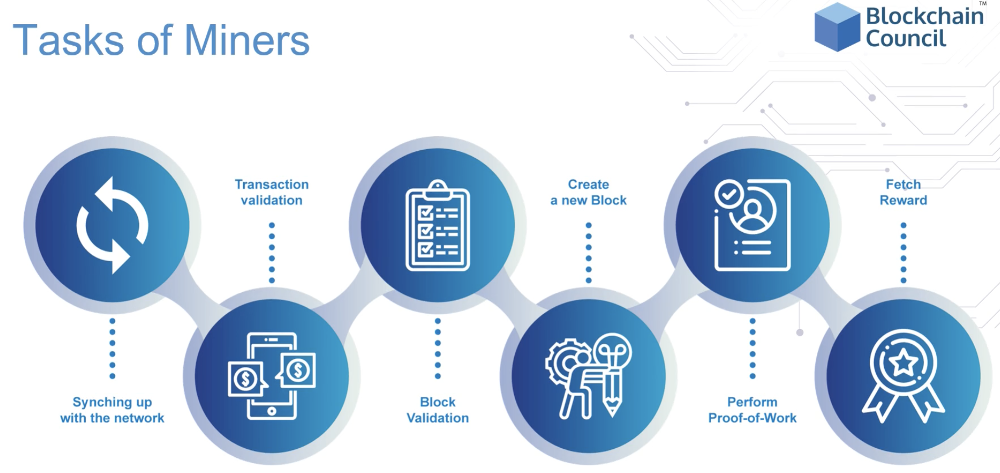
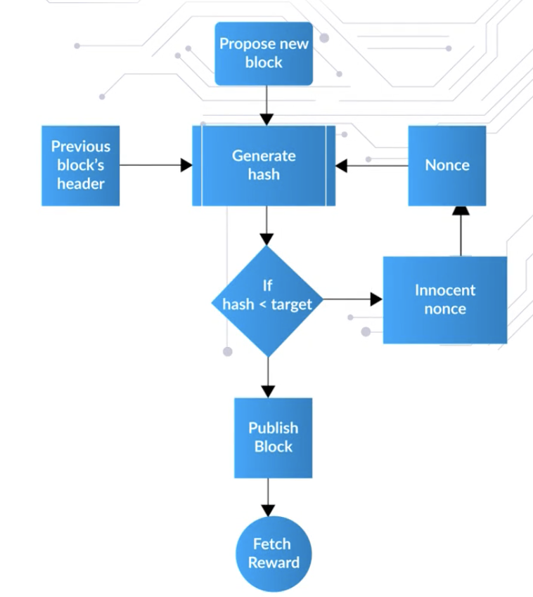
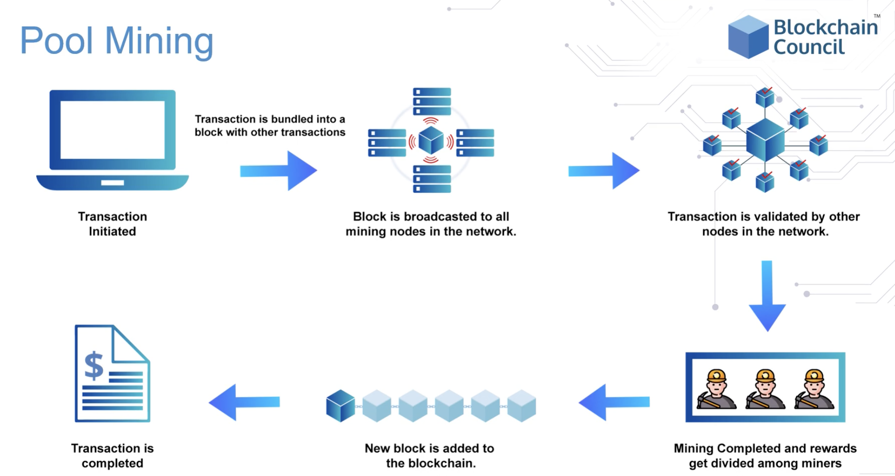
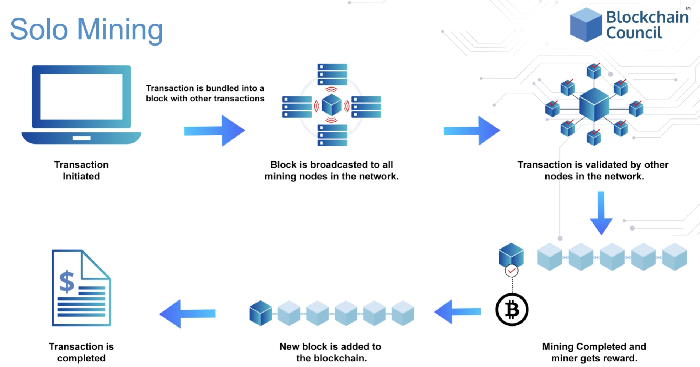

# what is blockchain mining?

mining validates a transaction before they become publicly available.

mining is the process of recording pending transactions by adding a new block into the blockchain through a mathematical puzzle.
- miners validate new transactions & record them on the blockchain.
- the miners, that are using cpu or gpu power, are competing to solve for the nonce.
- once a miner has guessed the nonce, they then broadcast it to the entire distributed p2p network

a block can only be added to the blockchain if its signature, the hash output starts with a certain amount of 0's.
- if a nonce of a block is changed, then the block gets a new signature.

winning miners get rewarded by receiving 5 ether per block of that blockchain, and the other miners attempt to solve next block.
- rewards are generally classified as new bitcoins or transaction fees

in transaction validation, newly created transactions broadcasted on the network are validated by full nodes by verifiying digital signatures and hash outputs.
- on completion, the miner broadcasts the solution and other nodes verify it before adding it to the blockchain.

# mining algorithm

1. retrieve the previous blocks hash from the network

2. assemble a set of transactions broadcasted on the network into a block to be proposed.

3. compute the double hash of the previous block's header combined with the nonce in the newly proposed block using sha256() algorithm.

4. validate if the resulting sha256() output hash is lower than the difficulty target.
- if yes, proof of work is solved and the discovered block is broadcasted to the network and miners receive reward.

- if sha256() output hash is not lower than the difficulty target, then repeat the process after incrementing the nonce.

- every node validates its blocks independently

# pool mining vs solo mining

pool mining means joining multiple GPU together and then mining on them faster which is helpful for large blockchains like bitcoin and ethereum.
- a single miner won't have enough resources to mine the blockchain.
- the rewarded is divided up among the participants depending on contributed amount of resources -- regardless if they solved the puzzle or not.

solo mining is where each miner sets up hardware & register himself for mining.
- the 1st miner to find the solution informs the other miners he has discovered the solution.

# longest chain rule

a blockchain with more blocks will consume more energy to build than a chain with fewer blocks.

- the difficulty also affects how much energy is consumed when mining a block.

- longest chain rule protect blocks that are already mined on to the blockchain since nodes will designate it as more important and valid version.

    - if a hacker tampers with a transaction, the merkle root hash would change and the hacker would have to update the preceeding blocks (computationally & temporally expensive) as well or suffer a shorter blockchain, invalidating it.

the longest chain rule resolves disagreements when 2 blocks are mined at the same time.

- chainwork is the total number of hashes to produce the current chain.